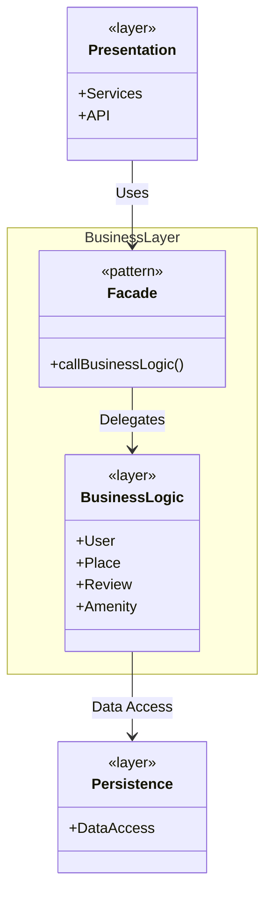

## HBnB

```mermaid
classDiagram
class Presentation {
  <<layer>>
  +Services
  +API
}
namespace BusinessLayer {
  class Facade {
    <<pattern>>
    +callBusinessLogic()
  }
  class BusinessLogic {
    <<layer>>
    +User
    +Place
    +Review
    +Amenity
  }
}
class Persistence {
  <<layer>>
  +DataAccess
}
Presentation --> Facade : Uses
Facade --> BusinessLogic : Delegates
BusinessLogic --> Persistence : Data Access
```