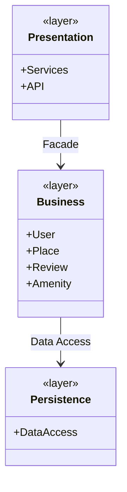
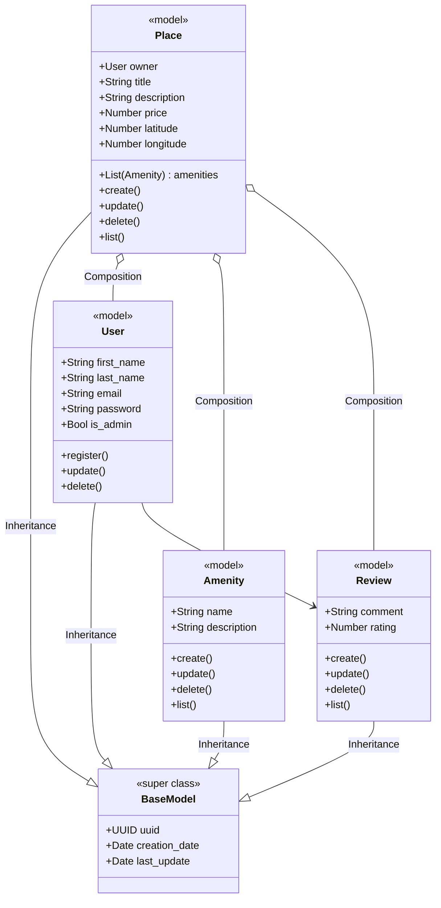
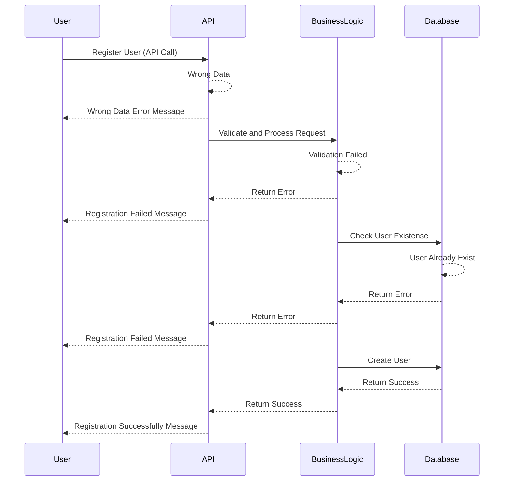
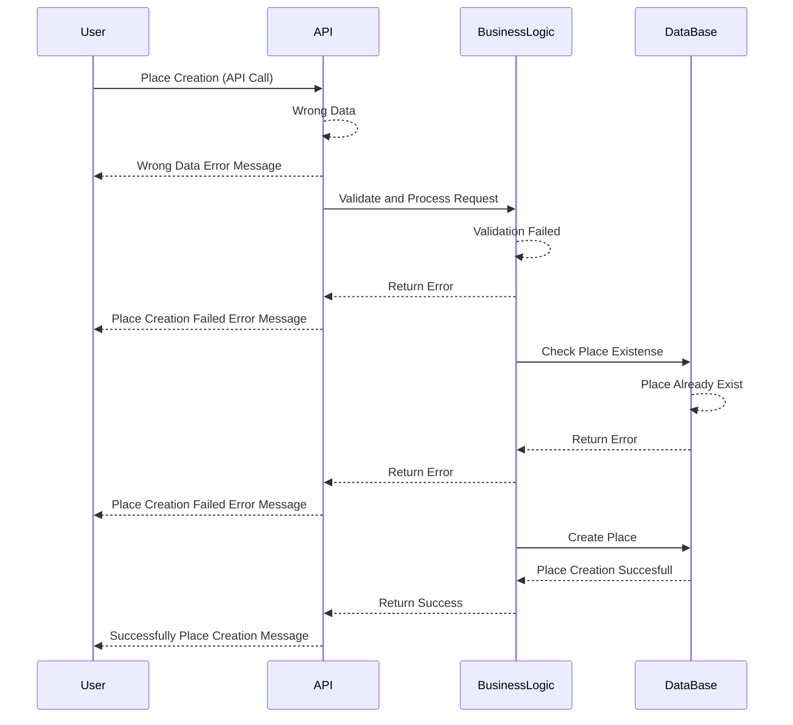
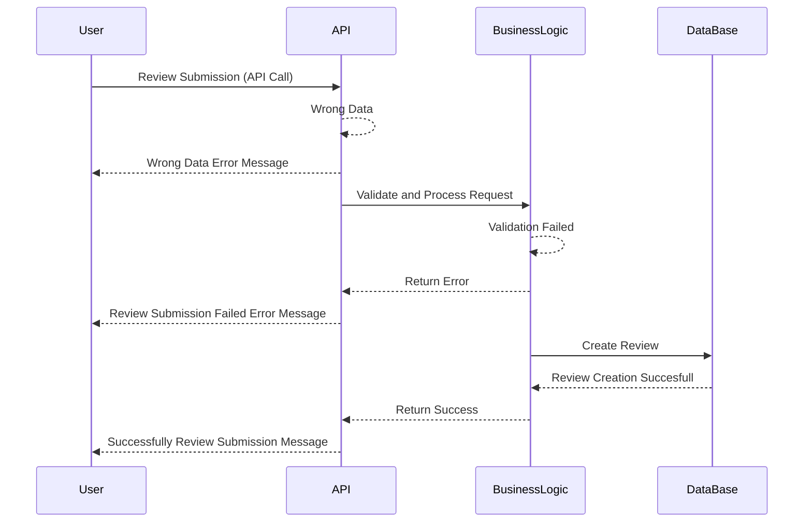
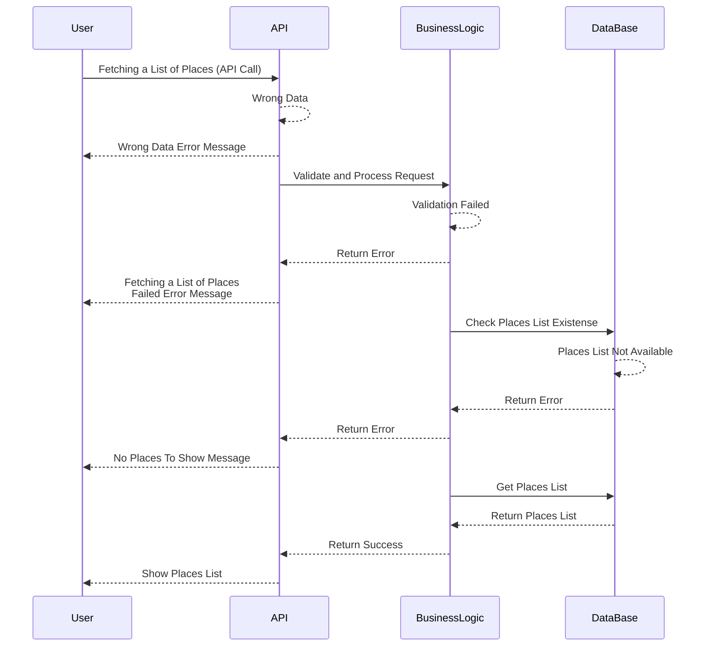

# HBnB Documentation

# Introduction to HBnB
This document was created to help understand and implement the HBnB project, a simplified version of AirBnB developed as part of a learning process. Its goal is to clearly explain how the system works, what components it consists of, and how to get it up and running step by step.

HBnB allows the management of data such as users, places to stay, reviews, and more, all through a well-organized structure designed to scale. Throughout this document, you will find information about the tools used, how they connect with each other, and what is needed for everything to work correctly.

The idea is that this guide serves as support both for those working directly on the project and for those who need to understand or maintain it in the future.

# High-Level Package Diagram

## Presentation Layer

### Interface between users and the system

Contents:
**Services**: Business-use endpoints (e.g. create user, book place).
**APIs**: HTTP interfaces used by frontend or third-party clients.

## Business Logic Layer

### The main part of the system - business rules, validations and workflows -

Contents:
Core domain **models**: User, Place, Review, Amenity

Business operations: e.g. register_user, add_place, etc.

## Persistence Layer

### Manages how data is stored/retrieved from the database

Contents:
Repositories / DAOs (Data Access Objects)

SQLAlchemy models, ORM mappings, raw queries, etc.

---

## The Facade Pattern

- The Facade Pattern provides a simplified and unified interface (While we work in tasks 0, 1 and 3, the API will be our interface)
- The Presentation Layer talks only to the Facade.
- The Facade delegates work to the Business Logic Layer.

Benefits:
- Reduces coupling between layers.
- Centralizes business flow.
- Makes the interface cleaner and more maintainable.

---

# Detailed Class Diagram for Business Logic Layer

---
# Detailed Class Diagram for Business Logic Layer
Entities & Relationships
The Business Logic Layer contains the core elements of the application, modeling real-world concepts such as users, places, reviews, and amenities. These entities work together to define the system’s main operations.

## User

Represents a person who interacts with the system.

Has attributes like id, name, and email.

Can create reviews and be associated with places.

## Place

Represents a location within the system.

Includes attributes such as id, name, address, and type.

Is connected to Reviews, which users create.

## Review

Stores a user's opinion about a place.

Includes details like rating, comment, and date.

Is linked to both the User (author of the review) and the Place (place being reviewed).

## Amenity

Represents features or services associated with a place.

Examples include Wi-Fi, Parking, or Accessibility.

Places can have multiple amenities, allowing flexible data management.

## How These Fit Into Business Logic
The Business Logic Layer processes requests and applies system rules. Instead of interacting directly with the database, the entities communicate through well-defined methods and relationships:

User interactions → Users can create, edit, or delete reviews of places.

Place management → Places are created, categorized, and associated with amenities.

Data validation and retrieval → Before saving a review, business rules such as rating and comment validity are verified.

## Facade Pattern
The facade pattern in the business logic layer acts as an intermediary between the presentation layer and business logic. Instead of the presentation layer interacting directly with multiple business components, the facade provides a single point of access. This reduces layer dependencies and simplifies integration.
# Sequence Diagrams for API Calls

## User Registration sequence

---
# User Registration Flow
## Overview
This sequence diagram describes the steps the system follows when a person attempts to register on the platform. It details how errors are handled and the conditions that must be met for registration to be successful.

## Flow Description

## Registration Request
The process begins when a person submits a request to register on the platform.

## Initial Review
The request is received by the system interface, which checks whether the submitted information is complete and properly structured:

If the information is incorrect, the system immediately responds with a message indicating the error.

## Logical Validation
If the data appears valid, it is passed to the system's logic layer for deeper validation:

If validation fails (e.g., due to invalid or incomplete data), a message is returned stating that registration cannot proceed.

## Existence Verification
If validation is successful, the system checks whether the person is already registered:

If an account with that information already exists, a message is returned indicating that registration cannot proceed.

If no such account exists, the system proceeds to create a new one.

## Registration Confirmation
When the account is successfully created, a confirmation is sent indicating that the registration was successful.

## Key Points

The process includes multiple checkpoints to ensure that only valid data is registered.

Various error scenarios are considered to provide clear and specific feedback.

The goal is to ensure each user is registered uniquely and correctly.

## Place Creation sequence

---
# API Interaction Flow – Place Creation
## Overview
This sequence diagram represents the interaction flow when a user attempts to create a new place through the HBnB project API. It shows how different components—User, API, Business Logic, and Database—communicate, explaining how the request is validated, processed, and either saved or rejected based on different scenarios.

## Flow Description
## User Request
The user sends a request to the API to create a new place, including details such as the name, location, and description.

## API Layer
The API receives the request and forwards it to the Business Logic layer, which is responsible for validating and processing the data.

## Business Logic – Validation
The business logic checks that the data is complete and properly structured:

If the data is invalid, an error message is returned to the API, which then responds to the user with an error message about incorrect data.

If the data is valid, the process continues with an attempt to save it to the database.

## Database Interaction
The business logic queries the database to check whether the place already exists:

If the place already exists, an error message is returned to the API, which then informs the user that the place cannot be created.

If the place does not exist, it is successfully saved to the database.

## Successful Response
Once the place is saved, a success message is sent to the API, which finally responds to the user indicating that the creation process was successful.

## Key Points
Error handling is performed during both data validation and duplicate checking.

Data validation ensures that only complete and unique entries are accepted.

## Review Submission sequence

---

# API Interaction Flow – Review Submission
## Overview
This sequence diagram represents the process that takes place when a user submits a review through the HBnB system. It details how the data is transmitted from the user to the API, then validated, and finally stored if it meets the necessary requirements.

## Flow Description
## User Request
The user submits a review with the intention of sharing their opinion about a previously visited place.

## API Reception
The API receives the review and forwards it to the component responsible for processing and validating it against the established conditions.

## Review Validation
The system checks whether the review is properly structured and contains the required information:

If the review is invalid, a message is returned to the user indicating that it could not be processed.

If the review is valid, the system proceeds to store it.

## Database Storage
The review is sent to the storage system and successfully recorded.

## User Confirmation
Finally, the user is notified that the review has been successfully received and saved.

## Key Points
The data is validated before being stored to ensure system integrity.

Communication between the different components ensures the process is clear and transparent for the user.

The system provides immediate feedback, either confirming the review was saved or indicating an issue with the submitted content.

## Fetching a List of Places sequence

# API Interaction Flow – Fetching a List of Places
## Overview
This sequence diagram describes the process that takes place when a user requests a list of available places in the HBnB system. It details how the request is validated, how the database is queried, and what responses are generated based on the outcome of that search.

## Flow Description
User Request
The user sends a request to retrieve a list of places, expecting to receive relevant information for their search.

## API Reception and Validation
The API receives the request and forwards it to the component responsible for business logic. There, the received parameters are analyzed to ensure that the request is properly formulated:

If the parameters are incorrect, a message is returned indicating that there was an error in the request.

## Database Query
If the parameters are valid, a query is made to the database to determine whether there are any places that match the request:

If matching results are found, they are returned to the user as a successful response.

If no places meet the criteria, a message is sent back indicating that no results were found.

## Key Points
Every request is first subjected to logical validation before accessing stored data.

Both successful cases and scenarios where no results are found or parameter errors occur are handled.

The system prioritizes response quality, providing clarity to the user in every possible situation.

