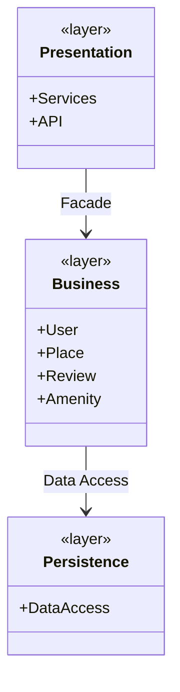
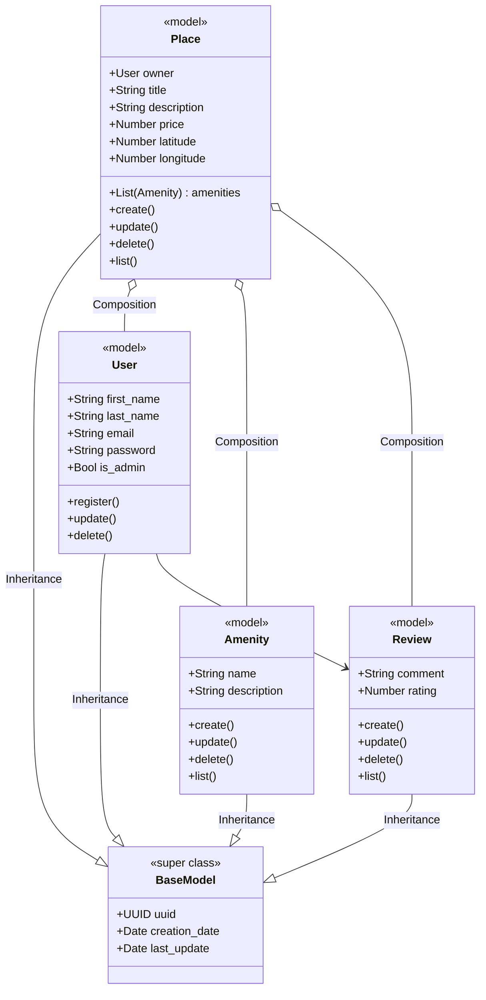
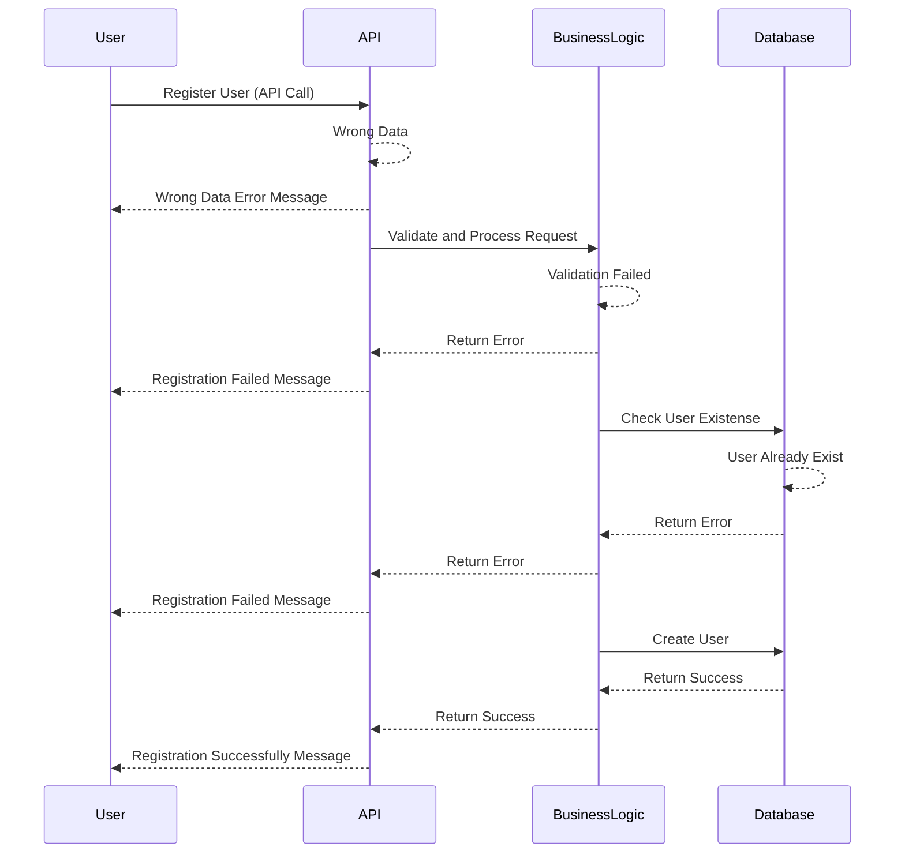
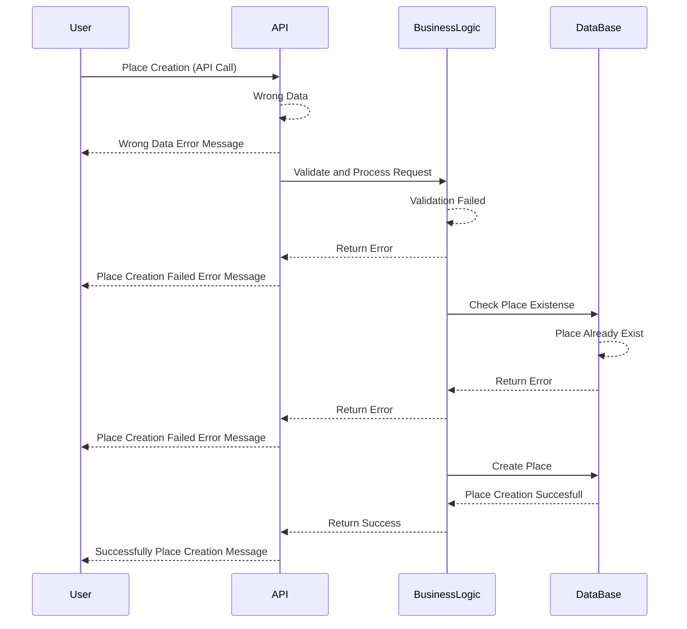
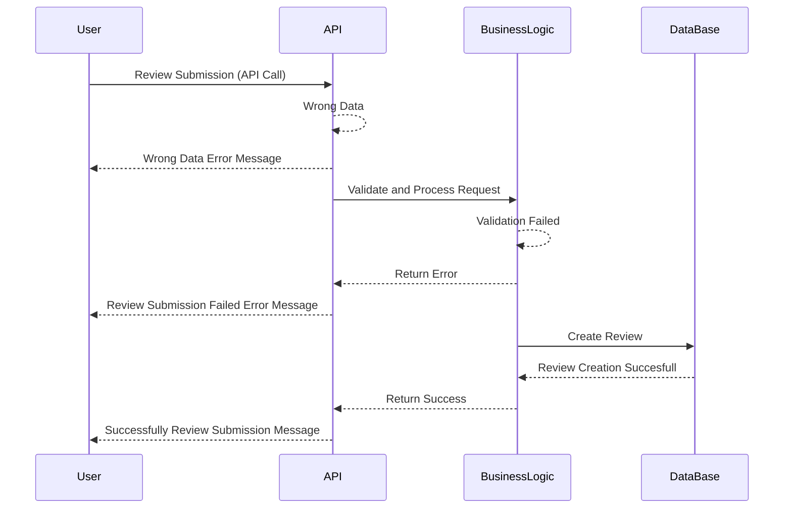
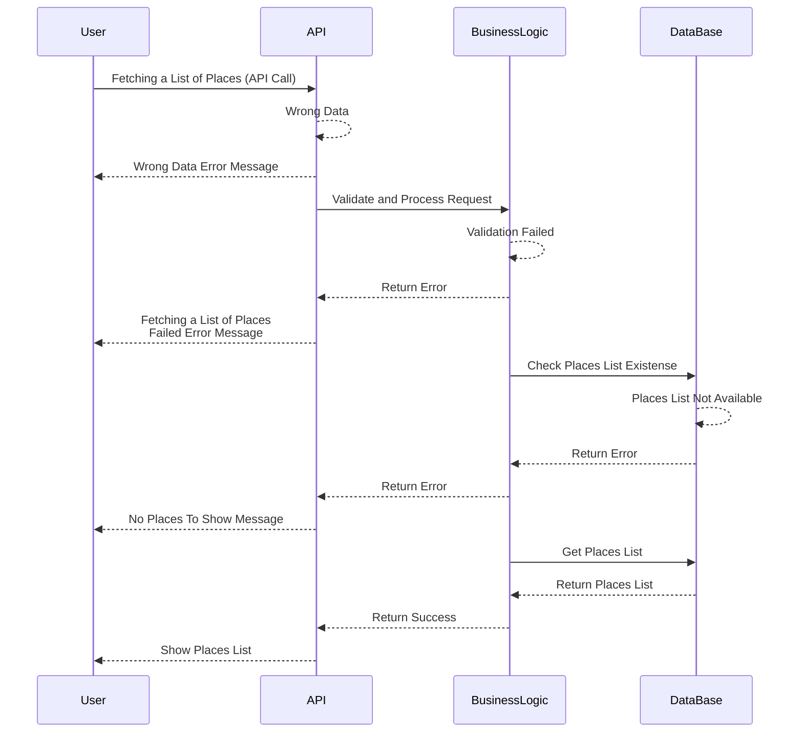

# HBnB Documentation

# Introduction to HBnB
This document was created to help understand and implement the HBnB project, a simplified version of AirBnB developed as part of a learning process. Its goal is to clearly explain how the system works, what components it consists of, and how to get it up and running step by step.

HBnB allows the management of data such as users, places to stay, reviews, and more, all through a well-organized structure designed to scale. Throughout this document, you will find information about the tools used, how they connect with each other, and what is needed for everything to work correctly.

The idea is that this guide serves as support both for those working directly on the project and for those who need to understand or maintain it in the future.

# High-Level Package Diagram

## Presentation Layer

### Interface between users and the system

Contents:
**Services**: Business-use endpoints (e.g. create user, book place).
**APIs**: HTTP interfaces used by frontend or third-party clients.

## Business Logic Layer

### The main part of the system - business rules, validations and workflows -

Contents:
Core domain **models**: User, Place, Review, Amenity

Business operations: e.g. register_user, add_place, etc.

## Persistence Layer

### Manages how data is stored/retrieved from the database

Contents:
Repositories / DAOs (Data Access Objects)

SQLAlchemy models, ORM mappings, raw queries, etc.

---

## The Facade Pattern

- The Facade Pattern provides a simplified and unified interface (While we work in tasks 0, 1 and 3, the API will be our interface)
- The Presentation Layer talks only to the Facade.
- The Facade delegates work to the Business Logic Layer.

Benefits:
- Reduces coupling between layers.
- Centralizes business flow.
- Makes the interface cleaner and more maintainable.

---

# Detailed Class Diagram for Business Logic Layer

---

# Sequence Diagrams for API Calls

## User Registration sequence

---

## Place Creation sequence

---

## Review Submission sequence

---

## Fetching a List of Places sequence

