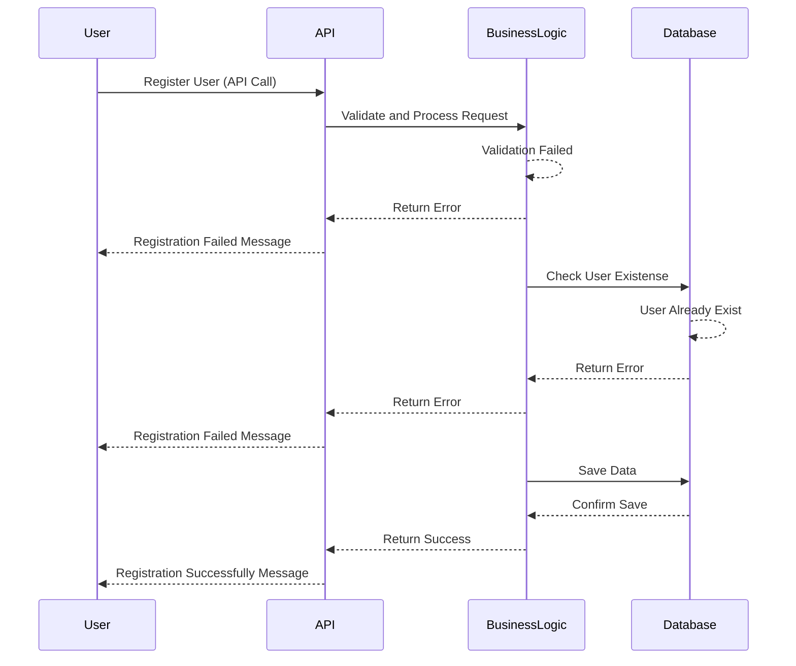

# HBnB Documentation

# High-Level Package Diagram

## Presentation Layer

### Interface between users and the system

Contents:
**Services**: Business-use endpoints (e.g. create user, book place).
**APIs**: HTTP interfaces used by frontend or third-party clients.

## Business Logic Layer

### The main part of the system - business rules, validations and workflows -

Contents:
Core domain **models**: User, Place, Review, Amenity

Business operations: e.g. register_user, add_place, etc.

## Persistence Layer

### Manages how data is stored/retrieved from the database

Contents:
Repositories / DAOs (Data Access Objects)

SQLAlchemy models, ORM mappings, raw queries, etc.

---

## The Facade Pattern

- The Facade Pattern provides a simplified and unified interface (While we work in tasks 0, 1 and 3, the API will be our interface)
- The Presentation Layer talks only to the Facade.
- The Facade delegates work to the Business Logic Layer.

Benefits:
- Reduces coupling between layers.
- Centralizes business flow.
- Makes the interface cleaner and more maintainable.

---

# Detailed Class Diagram for Business Logic Layer

---

# Sequence Diagrams for API Calls

## User Registration sequence

---

## Place Creation sequence

---

## Review Submission sequence

```mermaid
sequenceDiagram
participant User
participant API
participant BusinessLogic
participant Database

User->>API: Envia la reseña
API->>BusinessLogic: Valida la reseña
BusinessLogic -->> API: Reseña invalida codigo 404
API -->> User: Mensaje de error 
BusinessLogic ->> Database: Guarda la reseña
Database-->>BusinessLogic: Se guardo correctamente 
BusinessLogic-->>API: Quedo creada con exito, codigo 201 
API-->>User: Mensaje de exito 
```

---

## Fetching a List of Places sequence

